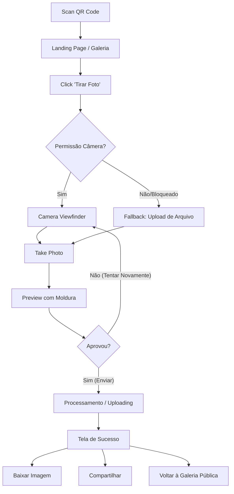

# USER-FLOWS.md

## Fluxo Principal de Captura (Happy Path)

## Tratamento de Erros no Fluxo

- **Falha de Upload:** Caso a internet esteja lenta ou caia durante o upload, manter a imagem no estado local, mostrar "Erro ao enviar. Tentar de novo" sem perder a foto.
- **Tamanho Excessivo:** Se a imagem (no caso de fallback de upload) for muito grande, comprimir via Canvas antes do upload para evitar rejeição do servidor.
