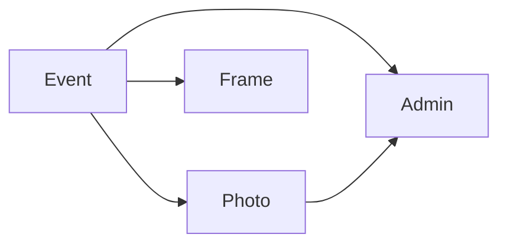

# CONCEPTUAL-DATA-MODEL.md

## Entidades Principais
| Entidade | Descrição | Principais Propriedades | Relacionamentos |
|----------|-----------|------------------------|-----------------|
| **Event** | Representa a festa (ex.: aniversário do Martin). | `id`, `name`, `slug`, `status` (active/inactive), `startDate`, `endDate`, `config` (JSON) | 1‑N **Photo**, 1‑N **Frame**, 1‑N **Admin** |
| **Photo** | Imagem enviada por um convidado. | `id`, `eventId`, `url`, `thumbnailUrl`, `metadata` (EXIF stripped), `status` (pending/approved/hidden), `uploadedAt` | N‑1 **Event**, N‑1 **Admin** (who approves/oculta) |
| **Frame** | Moldura gráfica temática que pode ser aplicada a uma foto. | `id`, `eventId`, `name`, `imageUrl`, `order` | N‑1 **Event** |
| **Admin** | Usuário com privilégios de gerenciamento. | `id`, `email`, `hashedPassword`, `role` (admin), `createdAt` | N‑1 **Event** |

## Diagrama Conceitual

## Regras de Negócio Relacionadas
- Cada **Moldura** pertence a um único **Evento** (RN‑003).
- Fotos só aparecem na galeria após aprovação (RN‑002).
- Convidado não tem conta; uploads são anônimos mas vinculados ao **Event**.

---
*Este modelo conceitual servirá de base para o esquema de banco de dados nas fases posteriores.*
